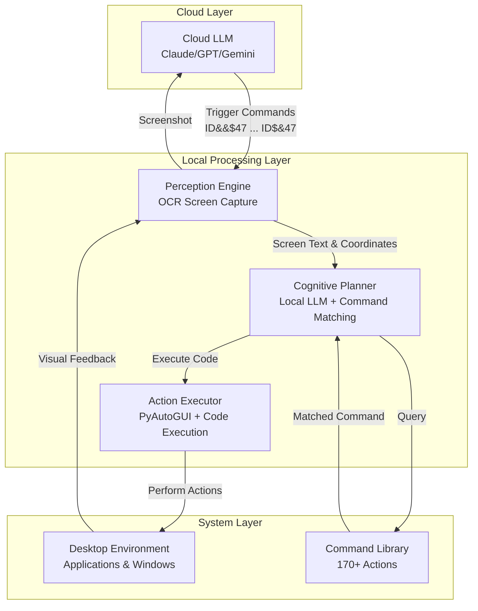
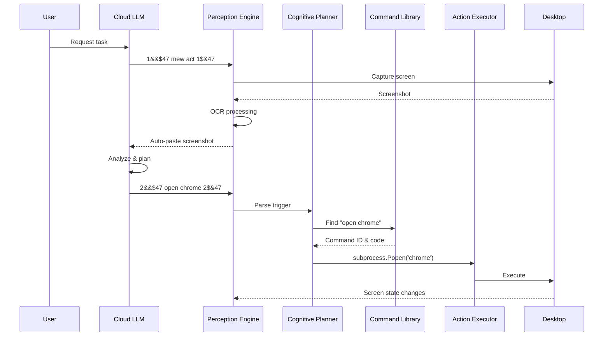
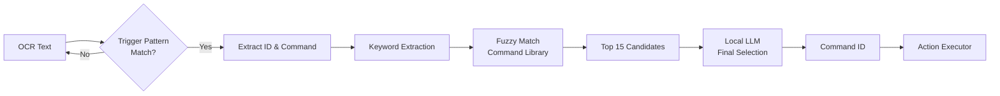
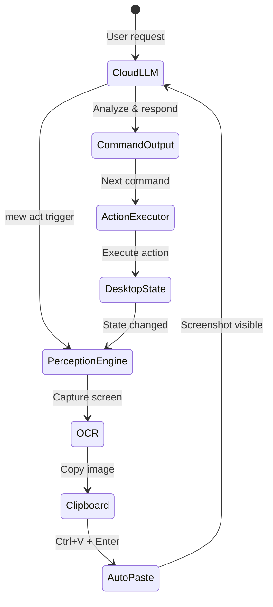

# MewAct Technical Documentation

## Overview

MewAct is a bridge system that enables Cloud-based LLMs (Claude, ChatGPT, Gemini) to execute desktop automation tasks through a Perception-Cognition-Action framework. The system uses OCR for screen perception, a local LLM for command selection, and PyAutoGUI for action execution.

---

## Architecture

### System Components

MewAct operates as a three-layer agent system:



### Process Flow



---

## Component Details

### 1. Perception Engine

**Purpose**: Captures and processes visual information from the desktop environment.

**Implementation**:
- **Screen Capture**: Uses `mss` library for multi-monitor screenshot capture
- **OCR Processing**: Supports three OCR engines with automatic fallback:
  - **RapidOCR** (default): Fast, CPU-based, 4 threads
  - **EasyOCR**: Higher accuracy, GPU optional
  - **PaddleOCR**: Highest accuracy, angle detection support
- **Text Normalization**: Unicode NFKD normalization to handle styled fonts (mathematical alphanumeric symbols)
- **Output**: Text coordinates `{text, x, y}` and full text string

**Key Features**:
- Window-specific targeting via Win32 API
- Multi-monitor support with selective capture
- Clipboard integration for `mew act` command

### 2. Cognitive Planner

**Purpose**: Interprets Cloud LLM commands and selects appropriate actions from the command library.

**Processing Pipeline**:



**Trigger Format**:
- Pattern: `(\d+)&&\$47\s*(.*?)\s*\1\$&47`
- Example: `5&&$47 open chrome 5$&47`
- ID matching ensures sequential execution and prevents duplicate triggers

**Command Selection**:
1. **Stage 1 (Keyword Filtering)**: Extract keywords from user goal, fuzzy match against 170+ commands
2. **Stage 2 (LLM Selection)**: Top 15 candidates sent to local LLM (Gemma/Llama via Ollama) for final selection
3. **Stage 3 (Validation)**: Verify command exists and is executable

### 3. Action Executor

**Purpose**: Executes the selected command code with variable injection.

**Execution Types**:

| Type | Format | Description |
|------|--------|-------------|
| `python` | `{"type": "python", "code": "..."}` | Execute Python code via `exec()` |
| `hotkey` | `{"type": "hotkey", "keys": ["ctrl", "c"]}` | Keyboard shortcuts via PyAutoGUI |
| `shell` | `{"type": "shell", "code": "dir"}` | PowerShell/shell commands via `subprocess` |
| `url` | `{"type": "url", "url": "https://..."}` | Open URLs in default browser |
| `file` | `{"type": "file", "path": "C:/..."}` | Open files with default application |
| `sequence` | `{"type": "sequence", "steps": [101, 106]}` | Chain multiple command IDs |

**Example Commands by Type**:

```json
// Hotkey - simple keyboard shortcuts
"copy": { "type": "hotkey", "keys": ["ctrl", "c"] }
"save": { "type": "hotkey", "keys": ["ctrl", "s"] }

// Shell - system commands
"list files": { "type": "shell", "code": "dir" }

// URL - quick links
"open github": { "type": "url", "url": "https://github.com" }

// Sequence - macro chains (IDs from command library)
"quick notepad": { "type": "sequence", "steps": [200, 106], "delay": 1.0 }
```

**Variable System**:

| Type | Format | Example | Injection |
|------|--------|---------|-----------|
| Inline | `command \| text` | `type \| hello` | `__VAR__` |
| Stored | `$V1`, `$V2` | `&&VAR 1 content VAR&&` | `__VAR1__`, `__VAR2__` |
| Implicit | No separator | `type hello` | Extracted via LLM prompt |

**Safety Features**:
- Execution ID tracking (prevents duplicate execution)
- Command validation before execution
- Error handling with graceful fallback
- Session recording capability

### 4. Auto-Rollback System

**Purpose**: Automatically refocuses the chat interface after executing navigation/desktop commands.

**Operation Modes**:
1. **Tab Search** (`--auto-rollback <chat_name>`): Uses Chrome/Edge tab search (Ctrl+Shift+A) to find the chat by name.
2. **Tab Toggle** (`--auto-rollback tab`): Uses simple Ctrl+Tab switching (ideal for 2-tab setups).
3. **Window Switch** (`--auto-rollback window:<title>`): Uses Windows API (`EnumWindows` + `SetForegroundWindow`) to focus a separate application window.

**Technical Logic**:
- **Triggers**: Executes after `executor.execute()` successfully completes.
- **Skipping**: Automatically skips rollback for `mew act` and `focus` commands to prevent focus loops.
- **Coordination**: Clicks the center-bottom area of the screen after focusing to ensure the chat input is active.

---

## Visual Feedback Loop

The `mew act` command creates a closed perception-action loop:



**Technical Details**:
- **Image Format**: BGRA → RGB conversion → BMP clipboard format
- **Auto-paste Mechanism**: `pyautogui.hotkey('ctrl', 'v')` + `pyautogui.press('enter')`
- **Timing**: 300ms clipboard delay, 500ms paste delay
- **Requirements**: Cursor must be in chat input field

---

## Available Commands

MewAct comes with a **massive command library** containing over 170+ actions (defined in `command_library.json`). The system intelligently finds the right command for your goal.

### Core Commands

| Command | Action |
|---------|--------|
| `open <app>` | Launch an application (e.g. `open calculator`) |
| `type \| <text>` | Type short text immediately |
| `type $V1` | Type long text from a variable |
| `click <text>` | Click on any text visible on screen |
| `press <key>` | Simulate a key press (e.g. `press enter`, `press f11`) |
| `wait <N>` | Pause execution for N seconds |
| `mew act` | Capture screen & auto-paste to chat |

### Hotkey Commands

| Command | Keys | Description |
|---------|------|-------------|
| `copy` | Ctrl+C | Copy selected content |
| `paste` | Ctrl+V | Paste from clipboard |
| `cut` | Ctrl+X | Cut selected content |
| `undo` | Ctrl+Z | Undo last action |
| `redo` | Ctrl+Y | Redo last action |
| `save` | Ctrl+S | Save current document |
| `select all` | Ctrl+A | Select all content |
| `close window` | Alt+F4 | Close active window |

### Tab Navigation Commands

| Command | Action |
|---------|--------|
| `focus chat` | Alt+Tab + click input field |
| `focus chatgpt` | Find ChatGPT window + focus input |
| `focus gemini` | Find Gemini window + focus input |
| `focus claude` | Find Claude window + focus input |
| `switch tab` | Ctrl+Tab + focus input |
| `previous tab` | Ctrl+Shift+Tab + focus input |
| `goto chatgpt tab` | Search tabs for "chatgpt" + focus |
| `goto gemini tab` | Search tabs for "gemini" + focus |
| `goto claude tab` | Search tabs for "claude" + focus |

### URL Commands

| Command | Action |
|---------|--------|
| `open google` | Open `https://google.com` |
| `open github` | Open `https://github.com` |
| `open youtube` | Open `https://youtube.com` |
| `open url \| <url>` | Open custom URL |
| `open file dialog` | Open the "Open File" system dialog |

### Interactive Control (Session 3)

| Command | Description |
|---------|-------------|
| `focus window | <title>` | Switch focus to a window matching the title |
| `set anchor` | Mark current window and mouse position |
| `focus anchor` | Return to marked window and click marked position |
| `set timer | <duration>` | Open Google Timer with specified duration |
| `snap window [left/right/up]` | Snap current window to screen edge |
| `open whatsapp` | Open WhatsApp Web (ID 220) |
| `open file \| <path>` | Open a specific file directly |

### Shell Commands

| Command | Action |
|---------|--------|
| `list files` | Run `dir` command |
| `system info` | Get OS name and version |
| `run powershell \| <cmd>` | Execute any shell command |

---

## Configuration

### Command-Line Interface

| Argument | Type | Description | Example |
|----------|------|-------------|---------|
| `--target` | String | Focus on specific window title | `--target "Chrome"` |
| `--monitors` | List[Int] | Monitor indices (1-based) | `--monitors 1,2` |
| `--ocr` | String | OCR engine selection | `rapidocr`, `easyocr`, `paddleocr` |
| `--auto-rollback`| String | Auto-focus back to chat (gemini/chatgpt/claude/tab/window:<title>) | `--auto-rollback gemini` |

### Configuration Constants

```python
MODEL_NAME = "gemma3:4b-cloud"    # Local LLM model
OCR_ENGINE = "rapidocr"           # OCR engine
TARGET_WINDOW_TITLE = ""          # Window filter
TARGET_MONITORS = []              # Monitor list (empty = all)
LOOP_DELAY = 0.2                  # Processing loop delay (seconds)
```

### Environment Requirements

| Dependency | Purpose | Installation |
|------------|---------|--------------|
| `numpy` | Array processing | `pip install numpy` |
| `opencv-python` | Image processing | `pip install opencv-python` |
| `mss` | Screen capture | `pip install mss` |
| `pyautogui` | Desktop automation | `pip install pyautogui` |
| `rapidocr-onnxruntime` | OCR (default) | `pip install rapidocr-onnxruntime` |
| `ollama` | Local LLM | `pip install ollama` + `ollama serve` |
| `pywin32` | Windows API | `pip install pywin32` |

---

## Troubleshooting

### Detection Issues

| Issue | Cause | Solution |
|-------|-------|----------|
| Trigger not detected | Window not visible | Ensure target window is on top |
| Trigger not detected | Stylish fonts | System normalizes unicode automatically (NFKD) |
| Trigger not detected | ID mismatch | Ensure opening and closing IDs match: `5&&$47 ... 5$&47` |
| Partial trigger detected | Multi-line command | Use explicit ID wrapping format |

### OCR Issues

| Issue | Cause | Solution |
|-------|-------|----------|
| Low accuracy | Poor contrast | Use dark mode or high-contrast themes |
| Missing text | Transparent background | Avoid busy/transparent backgrounds |
| Wrong coordinates | DPI scaling | Set Windows Display Scaling to 100% or run as Administrator |

### Execution Issues

| Issue | Cause | Solution |
|-------|-------|----------|
| Command not found | Library mismatch | Verify command exists in `command_library.json` |
| LLM timeout | Ollama not running | Ensure `ollama serve` is active |
| Variable not replaced | Variable not defined | Define variable with `&&VAR <id> ... VAR&&` before use |
| Duplicate execution | Repeated ID | Always increment ID: 1, 2, 3, ... |

### Performance Optimization

| Optimization | Recommendation | Impact |
|--------------|----------------|--------|
| Wait commands | Add `wait 1` after app launches | Prevents race conditions |
| Variable usage | Use `&&VAR` for text >50 chars | Reduces OCR processing time |
| Command splitting | Split complex actions | Improves reliability |
| Monitor targeting | Target specific monitors | Reduces OCR processing area |

---

## Advanced Configuration & Calibration

### 1. Scan Modes

Control how MewAct perceives the desktop environment.

| Mode | Flag | Description |
|------|------|-------------|
| **Monitor** (Default) | `--scan-mode monitor` | Scans monitor-by-monitor. |
| **Window** | `--scan-mode window` | Scans individual windows directly (Global Z-order). |

#### Strategies
- **Monitor Mode**:
    - `full` (Default): Captures entire monitor surface.
    - `window`: Captures valid application windows on the monitor.
    - Usage: `python mew.py --monitor-strategy window`

### 2. Adaptive OCR (Power Saver)

Optimizes performance for low-end hardware by splitting large windows.

- **Enable**: `python mew.py --power-saver`
- **Logic**: Windows occupying >53% of screen are split into horizontal strips with **30px vertical overlap** to ensure text on boundaries is captured.
- **Benefit**: Reduces peak memory usage and CPU load.
- **Note**: Disabled automatically in Window Scan Mode to preserve text integrity.

### 3. Multi-Monitor Setup

Target specific screens in a multi-monitor environment.

- **Flag**: `--monitors <indices>` (1-based)
- **Examples**:
    - `python mew.py --monitors 1` (Primary only)
    - `python mew.py --monitors 2,3` (Specific secondary screens)

### 4. GPU Acceleration

- **Default**: Enabled (`OCR_USE_GPU = True`).
- **Engines**: Supported by `EasyOCR` and `PaddleOCR`. `RapidOCR` uses ONNX runtime.
- **Fallback**: Automatically falls back to CPU if GPU is unavailable.

---

## Technical Specifications

### Trigger Pattern Regex

```regex
(\d+)&&\$47\s*(.*?)\s*\1\$&47
```

- **Group 1**: Execution ID (digits only)
- **Group 2**: Command text
- **Backreference**: `\1` ensures closing ID matches opening ID

### Variable Pattern Regex

```regex
&&VAR\s*(\d+)\s+(.*?)\s*VAR&&
```

- **Group 1**: Variable ID
- **Group 2**: Variable content (captured with `re.DOTALL`)

### OCR Text Normalization

```python
unicodedata.normalize('NFKD', text).encode('ascii', 'ignore').decode('utf-8')
```

Converts mathematical alphanumeric symbols (U+1D400–U+1D7FF) to standard ASCII.

---

## Security Considerations

⚠️ **Critical**: MewAct executes arbitrary code visible on screen.

**Threat Model**:
- Code execution runs with user permissions
- No sandbox or privilege separation
- OCR-based command injection possible if malicious content displayed

**Mitigations**:
- Only use with trusted Cloud LLMs
- Execute ID deduplication prevents replay attacks
- Keyword filtering reduces attack surface
- Monitor OCR output in debug mode

**Recommended Practice**:
- Run in isolated VM for testing
- Review `command_library.json` regularly
- Use `--target` flag to limit scope
- Enable debug mode for initial testing
